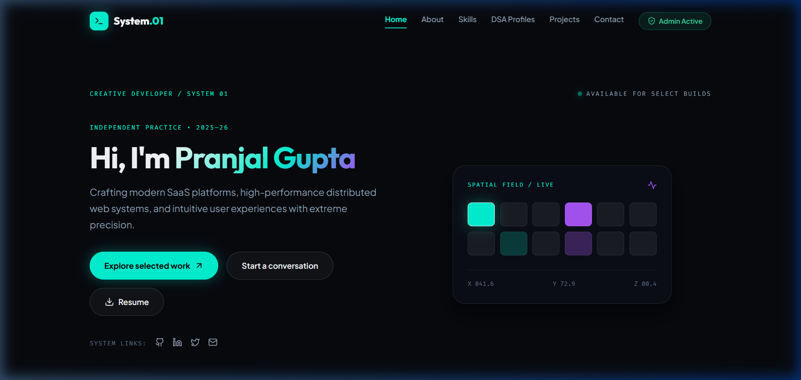
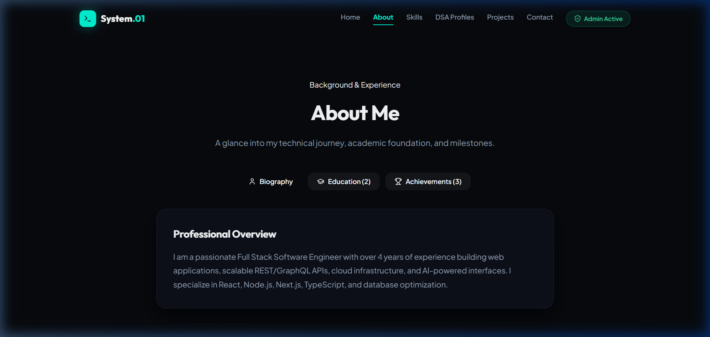
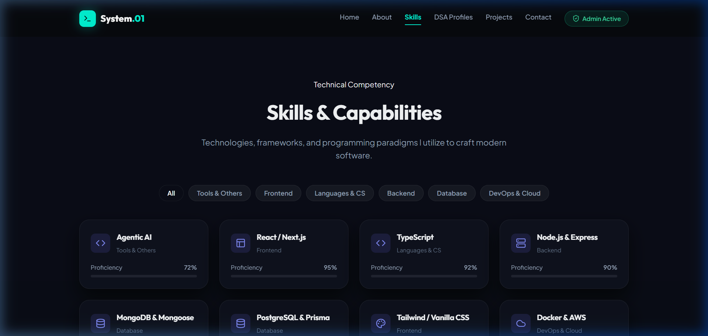
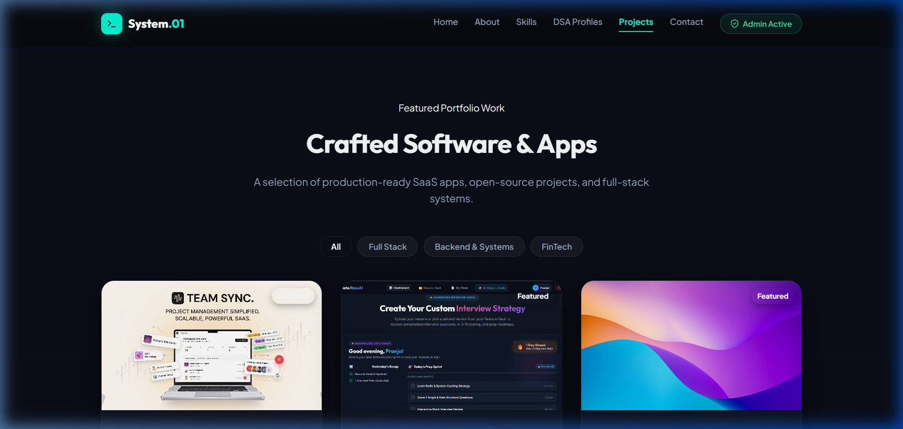

# 🚀 Spatial Cyberpunk Developer Portfolio & Admin CMS (v2)

[](https://portfolio-v2-ten-delta-45.vercel.app)
[](https://reactjs.org/)
[](https://nodejs.org/)
[](https://www.mongodb.com/)
[](https://tailwindcss.com/)

A modern **Full-Stack SaaS-Style Developer Portfolio & Protected CMS Dashboard** designed for **Pranjal Gupta**. Built with React 18, Vite, Tailwind CSS, Node.js, Express, and MongoDB.

🔗 **Live Portfolio Site**: [https://portfolio-v2-ten-delta-45.vercel.app](https://portfolio-v2-ten-delta-45.vercel.app)  
🐙 **GitHub Repository**: [https://github.com/pranjalgupta0280/Portfolio-v2](https://github.com/pranjalgupta0280/Portfolio-v2)

---

## 🌟 Visual Showcase

### 1. Home Landing & Spatial System Field


### 2. Dedicated About & Milestones Page


### 3. Tech Stack Matrix & Capabilities


### 4. Paginated Projects Showcase


---

## ✨ Key Features

- **Spatial Dark Aesthetic**: High-contrast neon cyan (`#00f5d4`) and electric purple (`#a855f7`) accents set against dark spatial grids.
- **Interactive Full-Screen Background**: Seamless video background integration with full-bleed canvas animations.
- **Dedicated Page Routing (`react-router-dom`)**:
  - `/` — System overview & featured builds
  - `/about` — Biography, academic foundation & milestones
  - `/skills` — Categorized tech stack & proficiency metrics
  - `/dsa` — Algorithmic platforms (Codeforces, LeetCode, CodeChef, GitHub)
  - `/projects` — 3-item paginated project grid with detail modals
  - `/contact` — Dynamic message submission form & social connect
- **Protected Admin CMS Panel (`/admin`)**:
  - Protected JWT Single-Admin login (`admin` / `admin123`).
  - Full CRUD management for Profile, Projects, Skills, DSA Profiles, Education & Awards, and Contact Messages Inbox.
  - Dual-mode image handling: Direct PNG/JPG file upload pickers converting to data URLs + external image links.
  - Automatic `.env` credential sync to MongoDB on boot.
- **Production Infrastructure**:
  - Flexible CORS origin policy supporting Vercel and local environments.
  - DNS SRV fallback handling (`Google/Cloudflare DNS` + local MongoDB fallback).

---

## 🛠️ Tech Stack

### Frontend
- **Framework**: React 18 + Vite
- **Routing**: React Router DOM (v7)
- **Styling**: Vanilla CSS + Tailwind CSS (v4)
- **Icons & Animations**: Lucide React, Framer Motion

### Backend
- **Server**: Node.js + Express.js
- **Database**: Mongoose / MongoDB Atlas (with local MongoDB fallback)
- **Authentication**: JWT (JSON Web Tokens) + Bcrypt.js password hashing
- **Deployment**: Render (Backend API) & Vercel (Frontend SPA)

---

## 🚀 Quick Start (Local Setup)

### Prerequisites
- Node.js (v18+)
- Local MongoDB (optional, if Atlas is not reachable)

### 1. Clone Repository
```bash
git clone https://github.com/pranjalgupta0280/Portfolio-v2.git
cd Portfolio-v2
```

### 2. Backend Setup
```bash
cd backend
npm install
```

Create a `.env` file in `backend/.env`:
```env
PORT=5000
MONGO_URI=mongodb+srv://<username>:<password>@cluster0.xzmvqso.mongodb.net/Portfolio
JWT_SECRET=your_super_secret_jwt_key
ADMIN_USERNAME=admin
ADMIN_PASSWORD=your_secure_password
```


Seed default portfolio content & admin account:
```bash
npm run seed
npm start
```

### 3. Frontend Setup
```bash
cd ../frontend
npm install
npm run dev
```

Open `http://localhost:5173` in your browser.

---

## 🔐 Default Admin Credentials

- **Admin Login Route**: Click **Admin Active / Portal** in the top navigation bar.
- **Username**: `admin`
- **Password**: `admin123`

---

## 🌐 Production Deployment Guide

### Deploy Backend to Render
1. Create a **New Web Service** on Render.
2. Root Directory: `backend`
3. Build Command: `npm install`
4. Start Command: `npm start`
5. Add Environment Variables: `MONGO_URI`, `JWT_SECRET`, `ADMIN_USERNAME`, `ADMIN_PASSWORD`.

### Deploy Frontend to Vercel
1. Import `frontend` project into Vercel.
2. Set Environment Variable: `VITE_API_URL=https://your-render-backend-url.onrender.com`.
3. Redeploy.

---

## 📄 License
This project is open-source under the MIT License. Developed by **[Pranjal Gupta](https://github.com/pranjalgupta0280)**.
